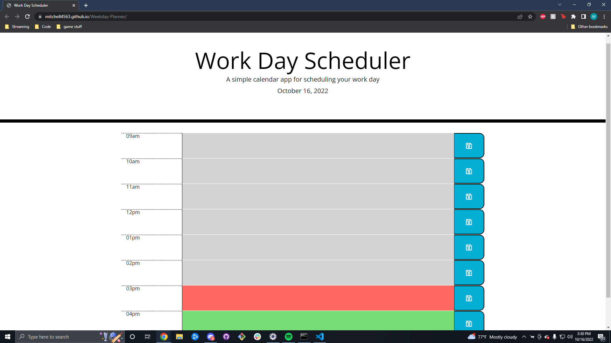

# Weekday-Planner

## Description

- My motivation to building this project was to give the user an easily accessible method of planning out their day by incrementing one hour blocks. I built it in part to help myself, as I have a lot of events I need to have ordered throughout the day, but mostly to provide a easy to use planner. It solves the problem of mentally keeping track of events throughout the day.

## Installation

N/A

## Usage

- You can visit the weekday planner at https://mitchell4563.github.io/Weekday-Planner/

- Once the page has loaded, you can type in any time block colored red or green. 

- Grey = past

- Red = Present

- Green = Future

- Clicking the save button to the right of the time block saves the event and it will stay there until deleted.